# Keras-Applications

## Contents

1. [CNN_MNIST](https://github.com/newhiwoong/Keras-Applications/blob/master/01_CNN_MNIST.ipynb) : CNN을 이용한 간단한 NMIST 진행  

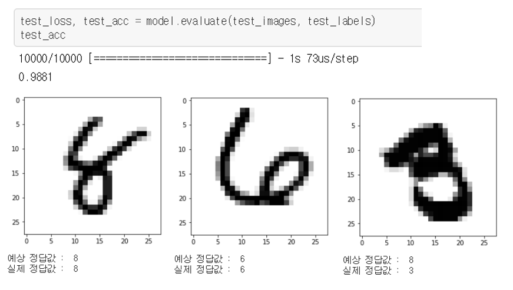

2. [CNN convnets with small datasets](https://github.com/newhiwoong/Keras-Applications/blob/master/02_CNN_convnets_with_small_datasets.ipynb) : 작은 Datasets의 데이터를 데이터 증식을 통해서 80% 이상의 높은 성능의 분류기 제작

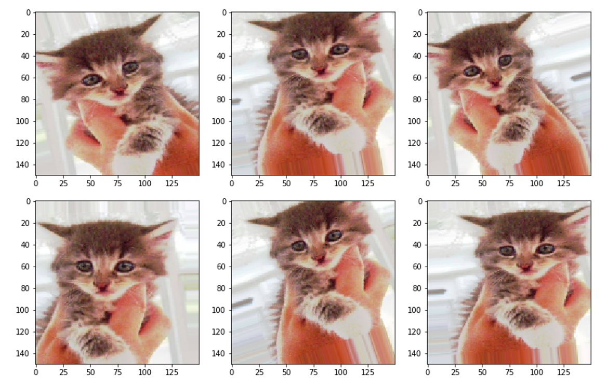

3. [CNN use pretrained VGG16](https://github.com/newhiwoong/Keras-Applications/blob/master/03_CNN_use_pretrained_VGG16.ipynb) : 이미 학습된 VGG16과 위에 데이터 증식을 응용해서 작은 Datasets에서 90%이상의 높은 성능을 갖는 분류기 제작

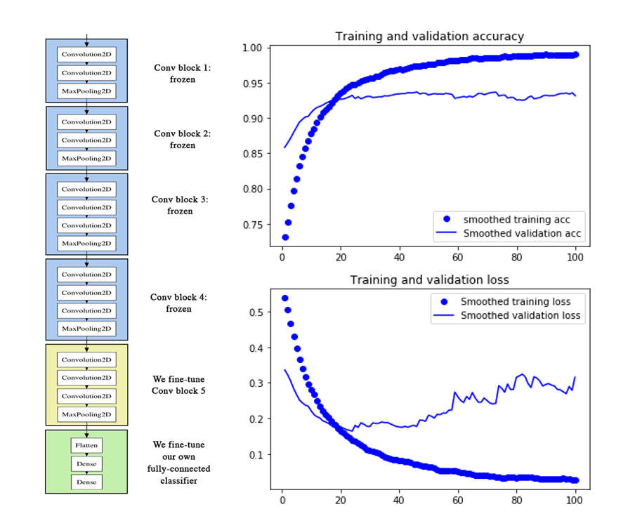

4. [CNN visualizing what convnets learn](https://github.com/newhiwoong/Keras-Applications/blob/master/04_CNN_visualizing_what_convnets_learn.ipynb) : convnets learn과정은 시각화와 CAM(Class Activation Map) 시각화를 통해 CNN 과정을 시각적으로 이해하기

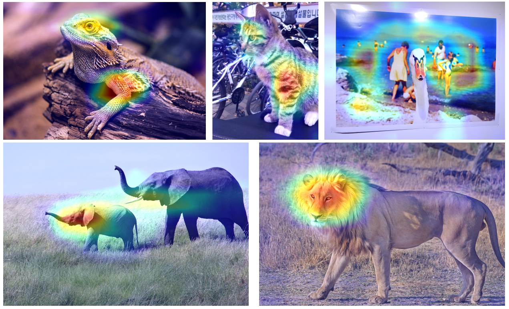

5. [RNN word embeddings](https://github.com/newhiwoong/Keras-Applications/blob/master/05_RNN_word_embeddings.ipynb) : one hot encoding제작, GloVe로 word embeddings을 만들어서 IMDB 영화의 긍부정 학습

6. [RNN understanding rnn lstm](https://github.com/newhiwoong/Keras-Applications/blob/master/06_RNN_understanding_rnn_lstm.ipynb) : RNN과 LSTM를 이용하여 IMDB 영화의 긍부정 학습을 하며 RNN과 LSTM의 사용방법 이해하기

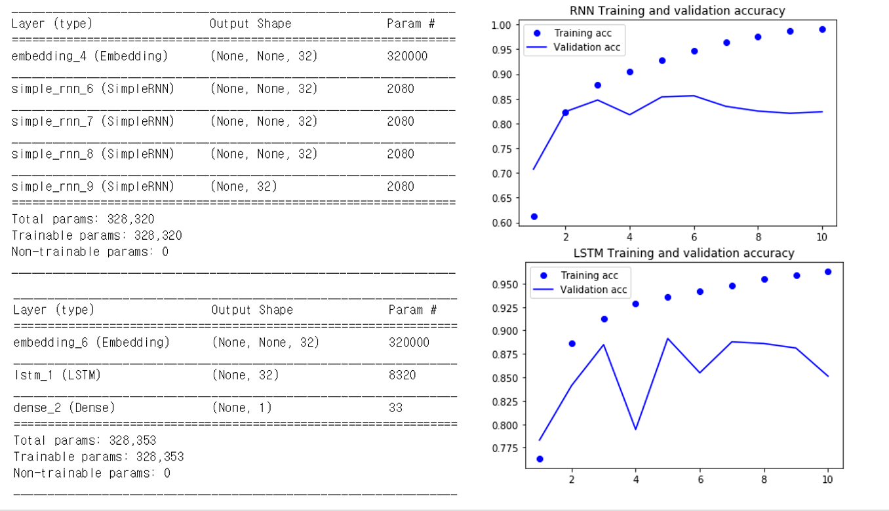

7. [RNN advanced usage of rnn](https://github.com/newhiwoong/Keras-Applications/blob/master/07_RNN_advanced_usage_of_rnn.ipynb) : 기온 예측 문제를 통해 RNN의 다양한 사용법 이해 (recurrent dropout, stacking recurrent layer, bidirectional recurrent layer)

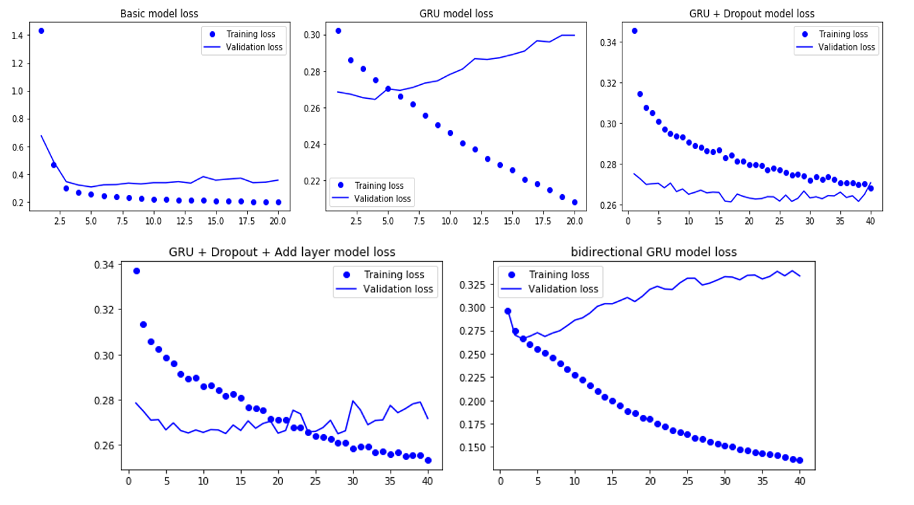

8. [RNN processing with convnets](https://github.com/newhiwoong/Keras-Applications/blob/master/08_RNN_processing_with_convnets.ipynb) : 1D convnets을 이용하여 특정 자연어 처리 같은 일부 문제에서 RNN을 대신하는 빠른 모델 제작

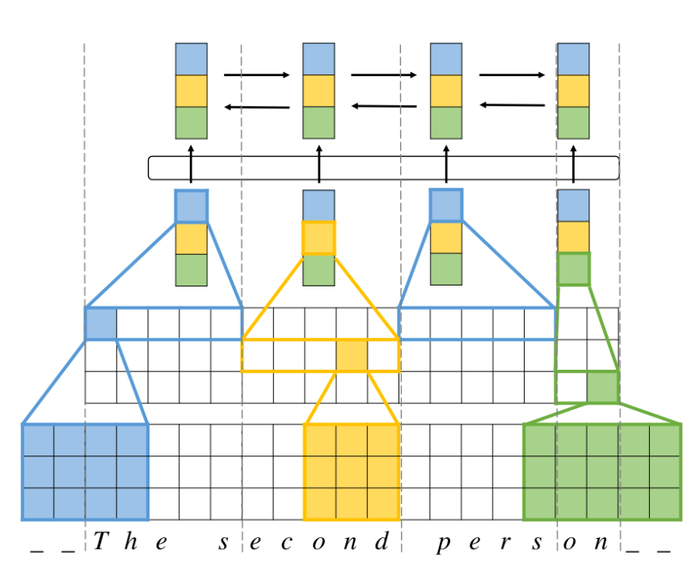  

> Image : https://arxiv.org/abs/1610.03017

9. [Advanced Keras Functional API](https://github.com/newhiwoong/Keras-Applications/blob/master/09_Advanced_Keras_Functional_API.ipynb) : 함수형 API를 통해서 다중 입력, 다중 출력 등 다양한 모델 제작

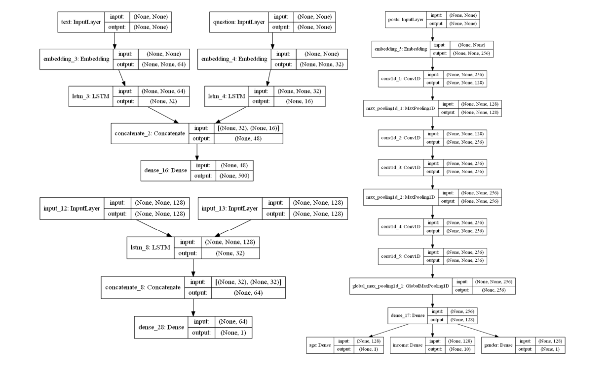

10. [Advanced Keras model checking and monitoring](https://github.com/newhiwoong/Keras-Applications/blob/master/10_Advanced_Keras_model_checking_and_monitoring.ipynb) : 콜백을 사용하여 모델의 훈련 과정을 제어하고 텐서보드를 이용하여 모니터링하기

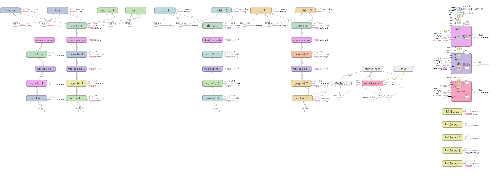

11. [Advanced Keras performance improvements](https://github.com/newhiwoong/Keras-Applications/blob/master/11_Advanced_Keras_performance_improvements.ipynb) : 정규화, 깊이별 분리 합성곱, 하이퍼파라미터 최적화, 모델 앙상블 등 모델의 성능을 향상시키는 방법을 학습하기

12. [Generation text with lstm](https://github.com/newhiwoong/Keras-Applications/blob/master/12_Generation_text_with_lstm.ipynb) : 언어 모델(LSTM과 샘플링)을 이용해서 니체의 글을 재생성하기

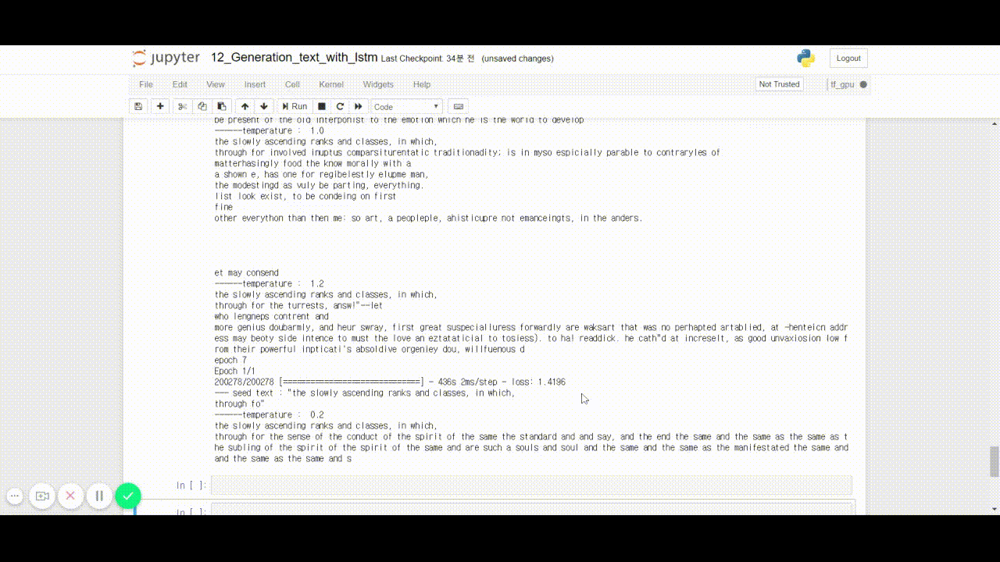

13. [Generation deep dream](https://github.com/newhiwoong/Keras-Applications/blob/master/13_Generation_deep_dream.ipynb) : 컨브넷을 거꾸로 실행하여 입력 이미지를 새롭게 생성하는 딥드림 제작

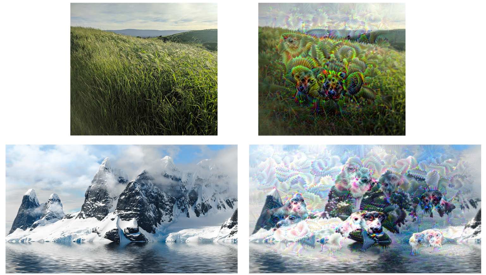

14. [Generation neural style transfer](https://github.com/newhiwoong/Keras-Applications/blob/master/14_Generation_neural_style_transfer.ipynb) : 유명한 명화의 스타일과 자신이 원하는 사진의 컨텐츠를 합성하기

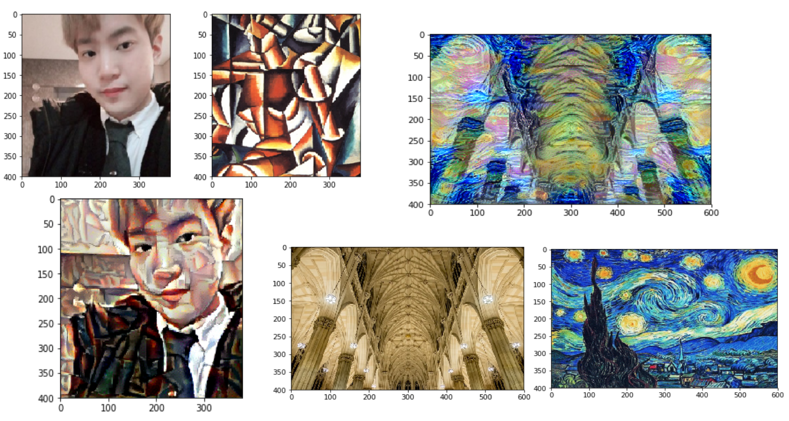

15. [Generation VAE](https://github.com/newhiwoong/Keras-Applications/blob/master/15_Generation_VAE.ipynb) : VAE를 이용해서 간단한 MNIST 이미지 생성

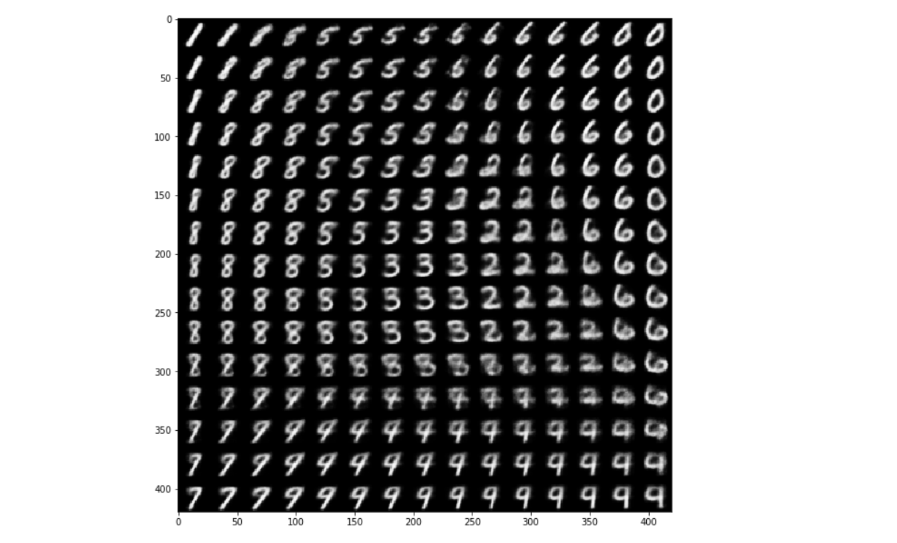

## Sequence Models

- [Dinosaurus land](https://github.com/newhiwoong/Sequence-Models-coursera/blob/master/Week%201/Dinosaur%20Island%20--%20Character-level%20language%20model/Dinosaurus%2BIsland%2B--%2BCharacter%2Blevel%2Blanguage%2Bmodel%2Bfinal%2B-%2Bv3.ipynb)

- [Improvise a Jazz Solo](https://github.com/newhiwoong/Sequence-Models-coursera/blob/master/Week%201/Jazz%20improvisation%20with%20LSTM/Improvise%2Ba%2BJazz%2BSolo%2Bwith%2Ban%2BLSTM%2BNetwork%2B-%2Bv3.ipynb)

- [Emojify](https://github.com/newhiwoong/Sequence-Models-coursera/blob/master/Week%202/Emojify/Emojify%2B-%2Bv2.ipynb)

- [Neural Machine Translation](https://github.com/newhiwoong/Sequence-Models-coursera/blob/master/Week%203/Machine%20Translation/Neural%2Bmachine%2Btranslation%2Bwith%2Battention%2B-%2Bv4.ipynb)

- [Trigger Word Detection](https://github.com/newhiwoong/Sequence-Models-coursera/blob/master/Week%203/Trigger%20word%20detection/Trigger%2Bword%2Bdetection%2B-%2Bv1.ipynb)

## Reference

> [Keras examples directory](https://github.com/keras-team/keras/tree/master/examples)  
> [Deep Learning with Python](https://www.amazon.com/Deep-Learning-Python-Francois-Chollet/dp/1617294438/)  
> [Deep Learning with Python Code](https://github.com/fchollet/deep-learning-with-python-notebooks)  
> [케라스 창시자에게 배우는 딥러닝](https://github.com/rickiepark/deep-learning-with-python-notebooks)  
> [Coursera Sequence Models](https://www.coursera.org/learn/nlp-sequence-models):[Code](https://github.com/newhiwoong/Sequence-Models-coursera)
