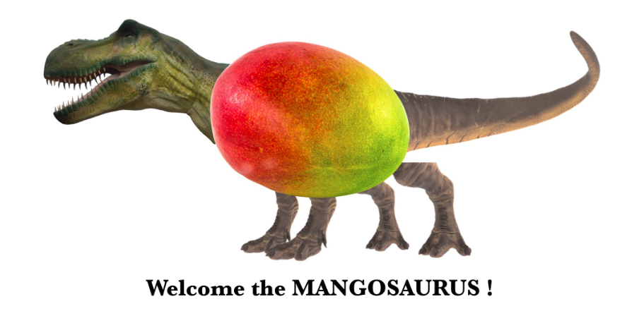
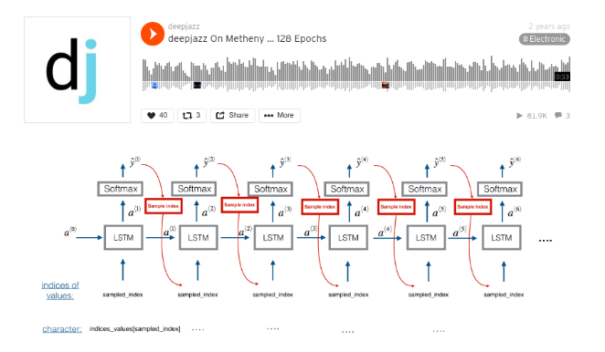
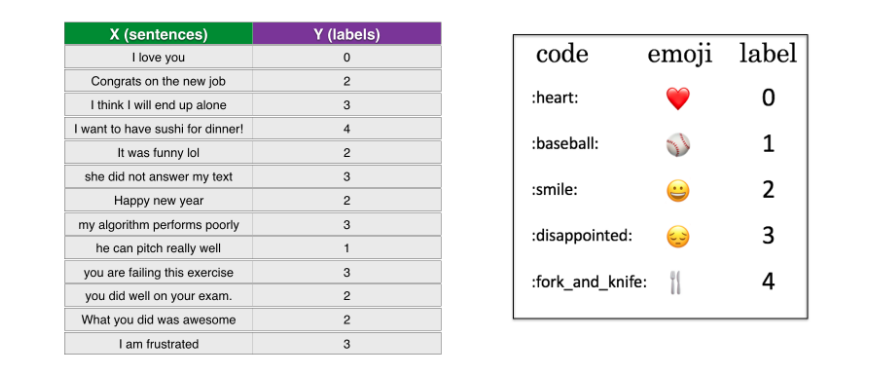
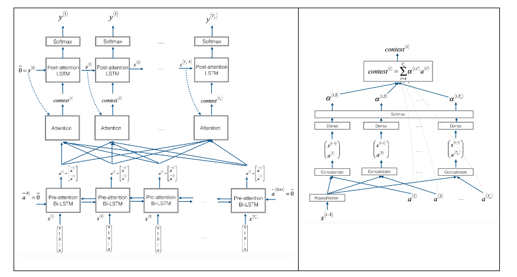
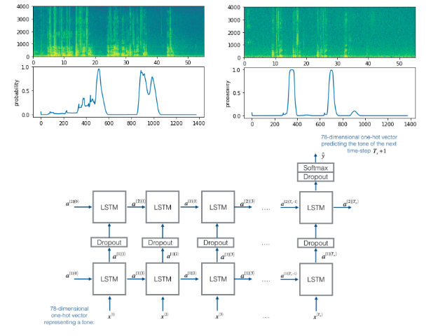

# Keras-Applications

1. [CNN_MNIST](https://github.com/newhiwoong/Keras-Applications/blob/master/01_CNN_MNIST.ipynb) : CNN을 이용한 간단한 NMIST 진행  

2. [CNN convnets with small datasets](https://github.com/newhiwoong/Keras-Applications/blob/master/02_CNN_convnets_with_small_datasets.ipynb) : 작은 Datasets의 데이터를 데이터 증식을 통해서 80% 이상의 높은 성능의 분류기 제작

3. [CNN use pretrained VGG16](https://github.com/newhiwoong/Keras-Applications/blob/master/03_CNN_use_pretrained_VGG16.ipynb) : 이미 학습된 VGG16과 위에 데이터 증식을 응용해서 작은 Datasets에서 90%이상의 높은 성능을 갖는 분류기 제작

4. [CNN visualizing what convnets learn](https://github.com/newhiwoong/Keras-Applications/blob/master/03_CNN_use_pretrained_VGG16.ipynb) : convnets learn과정은 시각화와 CAM(Class Activation Map) 시각화를 통해 CNN 과정을 시각적으로 이해하기

5. [RNN word embeddings](https://github.com/newhiwoong/Keras-Applications/blob/master/05_RNN_word_embeddings.ipynb) : one hot encoding제작, GloVe로 word embeddings을 만들어서 IMDB 영화의 긍부정 학습

6. [RNN understanding rnn lstm](https://github.com/newhiwoong/Keras-Applications/blob/master/06_RNN_understanding_rnn_lstm.ipynb) : RNN과 LSTM

## Sequence Models 

- [Dinosaurus land](https://github.com/newhiwoong/Sequence-Models-coursera/blob/master/Week%201/Dinosaur%20Island%20--%20Character-level%20language%20model/Dinosaurus%2BIsland%2B--%2BCharacter%2Blevel%2Blanguage%2Bmodel%2Bfinal%2B-%2Bv3.ipynb)

- [Improvise a Jazz Solo](https://github.com/newhiwoong/Sequence-Models-coursera/blob/master/Week%201/Jazz%20improvisation%20with%20LSTM/Improvise%2Ba%2BJazz%2BSolo%2Bwith%2Ban%2BLSTM%2BNetwork%2B-%2Bv3.ipynb)

- [Emojify](https://github.com/newhiwoong/Sequence-Models-coursera/blob/master/Week%202/Emojify/Emojify%2B-%2Bv2.ipynb)

- [Neural Machine Translation](https://github.com/newhiwoong/Sequence-Models-coursera/blob/master/Week%203/Machine%20Translation/Neural%2Bmachine%2Btranslation%2Bwith%2Battention%2B-%2Bv4.ipynb)

- [Trigger Word Detection](https://github.com/newhiwoong/Sequence-Models-coursera/blob/master/Week%203/Trigger%20word%20detection/Trigger%2Bword%2Bdetection%2B-%2Bv1.ipynb)

## Reference

> [케라스 창시자에게 배우는 딥러닝](https://github.com/rickiepark/deep-learning-with-python-notebooks)  
> [Keras examples directory](https://github.com/keras-team/keras/tree/master/examples)  
> [Coursera Sequence Models](https://www.coursera.org/learn/nlp-sequence-models) : [Code](https://github.com/newhiwoong/Sequence-Models-coursera)
